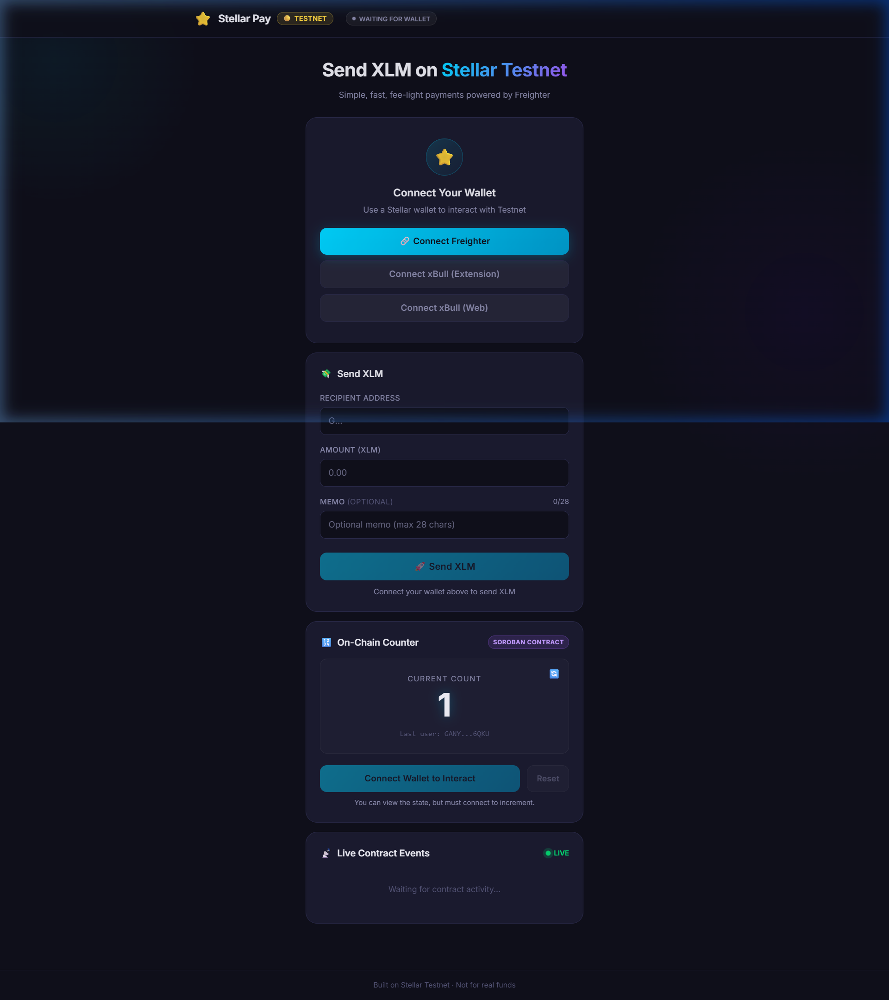

# 🌟 Stellar Pay – Simple Payment & Counter dApp

[](https://stellar.expert/explorer/testnet)
[](https://vitejs.dev/)
[](https://tailwindcss.com/)
[](https://white-belt-level-1-khushinagare04-5573s-projects.vercel.app/)

**Stellar Pay** is a high-performance, decentralized payment application built for the **Stellar Testnet**. It provides a sleek, modern interface for managing testnet funds and interacting with on-chain Soroban smart contracts.

### 🏆 Level 4 Graduation Features
- **Factory Contract Architecture** – Deploys and manages specialized swap pools.
- **Constant Product AMM** – Automated swaps ($x \cdot y = k$) with safe fixed-point math.
- **CI/CD Pipeline** – Full GitHub Actions coverage for linting, testing, and builds.
- **Mobile-Responsive DEX UI** – A premium swap interface optimized for all devices.

---

### 🌐 Live Demo & Deployment
- **🎥 [Video Demo (Loom)](https://www.loom.com/share/3e28bd26ea6a4d6bbdbfd2563faa76f3)**
- **🚀 [View Live Site](https://white-belt-level-1-khushinagare04-5573s-projects.vercel.app/)**


---

## 🖼️ App Screenshot


*Modern, dark-themed UI with real-time balance tracking and contract interaction.*

---

## 📱 Mobile Responsiveness Review
The application has been audited for mobile responsiveness:
- **Breakpoint 375px (iPhone SE)**: Fully functional, vertical stacking of all glassmorphic components.
- **Breakpoint 768px (iPad)**: Dual-column adaptive layout for enhanced usability.
- **Touch-Targets**: Buttons and inputs use a minimum 44px height for optimal reachability.

---

## 🔗 Deployed Smart Contracts (Testnet)

| Contract | ID | Explorer |
| :--- | :--- | :--- |
| **Counter** | `CDJJ5BYJHWZBXRRX5M2XAEX5GMINIR3FDEAL4H7KRUZJXTXL44KCS2ZY` | [View](https://stellar.expert/explorer/testnet/contract/CDJJ5BYJHWZBXRRX5M2XAEX5GMINIR3FDEAL4H7KRUZJXTXL44KCS2ZY) |
| **AMM Pool** | `CAK354J3HN5ONXP6YVUBXCLGIV5IGFN233DDA3ZGR5CHKFZIRGUSDQ2R` | [View](https://stellar.expert/explorer/testnet/contract/CAK354J3HN5ONXP6YVUBXCLGIV5IGFN233DDA3ZGR5CHKFZIRGUSDQ2R) |
| **AMM Factory** | `CBH2ZUUG6V77UR4VSAUBRZOOGMEP6ZQU7XXJWFY6E536MP5M5ZT7IXWQ` | [View](https://stellar.expert/explorer/testnet/contract/CBH2ZUUG6V77UR4VSAUBRZOOGMEP6ZQU7XXJWFY6E536MP5M5ZT7IXWQ) |

---

## 🚀 Key Features

- **Multi-Wallet Support** – Connect seamlessly with **Freighter**, **xBull (Extension)**, or **xBull (Web)**.
- **Instant Faucet** – One-click funding via **Friendbot** (10,000 test XLM).
- **Smooth Payments** – Send XLM to any Stellar address with real-time validation and fee calculation.
- **On-Chain Counter** – Interact with a Soroban smart contract to `increment` and `reset` a global state.
- **Live Event Feed** – Watch contract events happen in real-time with our built-in event listener.
- **Dark Mode Aesthetics** – Sleek, low-light design optimized for developers.

---

## 🛠️ Tech Stack

- **Frontend**: React 18 + Vite 5
- **Styling**: Tailwind CSS 3
- **Blockchain**: `@stellar/stellar-sdk` (Horizon + Soroban RPC)
- **Wallets**: `@stellar/freighter-api`, `@creit.tech/stellar-wallets-kit`, `@creit.tech/xbull-wallet-connect`
- **Tests**: Vitest + Testing Library

---

## ⚙️ Local Development

### 1. Install Dependencies
```bash
npm install
```
*Note: If `npm install` fails due to dependency conflicts, use `npm install --ignore-scripts`.*

### 2. Configure Environment
Create a `.env` file in the root:
```env
VITE_CONTRACT_ID=CDJJ5BYJHWZBXRRX5M2XAEX5GMINIR3FDEAL4H7KRUZJXTXL44KCS2ZY
VITE_NETWORK_PASSPHRASE="Test SDF Network ; September 2015"
VITE_RPC_URL=https://soroban-testnet.stellar.org
VITE_HORIZON_URL=https://horizon-testnet.stellar.org
```

### 3. Run Development Server
```bash
npm run dev
```

---

## 🧪 Testing

Run unit and component tests:
```bash
npm test
```

---

## 📁 Project Structure

- **/src**: Main Stellar Pay dApp source code and core components.
- **/contract**: Soroban smart contract source code (Rust).
- **/crypto-portfolio**: A separate Ethereum-based portfolio tracker dApp using ethers.js.
- **/stellar-payment-dapp**: A specialized implementation of the Stellar payment flow.
- **/scripts**: Deployment and automation scripts for Soroban contracts.

---

*Built with ❤️ on Stellar Testnet · Not for use with real XLM funds.*

